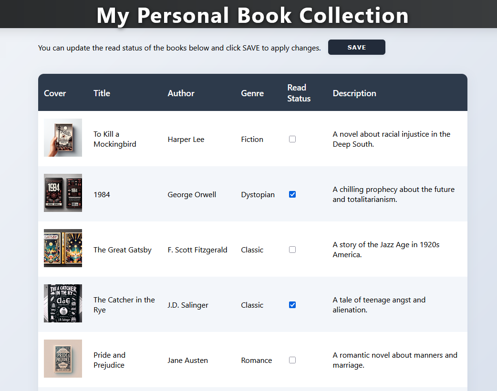

## Built 100% with GenAI: No-Code Full Stack App




## Live Demo & API
- **Site:** <a href="https://lemon-pebble-088965b1e.1.azurestaticapps.net/" target="_blank">https://lemon-pebble-088965b1e.1.azurestaticapps.net/</a>
- **Data API:** <a href="https://lemon-pebble-088965b1e.1.azurestaticapps.net/data-api/api/Books" target="_blank">https://lemon-pebble-088965b1e.1.azurestaticapps.net/data-api/api/Books</a>

## Overview

This project showcases a full-stack web app built entirely with GenAI tools—no manual coding involved. Using Azure Static Web Apps, Blazor, Azure SQL, Data API Builder, and Azure OpenAI (DALL-E 3) for image generation, every stage—from database design to UI and API integration—was guided by GitHub Copilot and AI-powered workflows.


For more details and a step-by-step Copilot chat log, see [`CopilotPrompt.md`](CopilotPrompt.md).


## Prerequisites
- ChatGPT or Copilot account
- GitHub repository
- Azure Static Web App
- Azure SQL Database
- Azure OpenAI Service (DALL-E 3 model for images)
- VS Code (locally or Codespaces)

### Recommended VS Code Extensions
- Python
- SQL Server (mssql)
- Azure Static Web Apps
- GitHub Copilot
- GitHub Actions

---

## Project Steps

### 1. Brainstorm and Plan
Ask ChatGPT for simple web app ideas. Example prompt:

```
Give me ideas for a simple web app using static web apps in Azure, mostly for learning and teaching, 
a simple CRUD with just one table in Azure SQL DB
```

Select a topic (e.g., Book List App) and define the table structure:
- Table: Books
- Columns: BookID, Title, Author, Genre, ReadStatus

---

### 2. Create Database Objects and Records
Use Copilot or ChatGPT with the MSSQL extension to generate the SQL for your table and sample data. Example prompt:

```
@mssql Personal Book Library
Table: Books
Columns: BookID, Title, Author, Genre, ReadStatus
Please generate the CREATE TABLE statement and then insert 20 book records on it
please generate the .sql files on a new folder called DABATASE
generate the DROP TABLE command if the table exists in the same file as the CREATE statement
```

If you need to add fields (e.g., Description), prompt Copilot to update the schema and data. Run the scripts to create the table and records, then commit the changes.

---

### 3. Generate a Hello World Blazor App
Create a new static web app in VS Code (advanced mode, Blazor). Commit the generated files. Use Copilot to scaffold a Hello World page and validate the build:

```
Create a Hello world web site for Azure Static web apps.
I want a simple page to display hello world message
Static web app must use blazor and please create all the required folders and files so it can be properly deployed to azure using action file
```

If you see issues (e.g., "Page not found"), ask Copilot to fix them. Commit once the app loads correctly.

---

### 4. Configure Data API Builder
Connect your Azure SQL Database to the Static Web App. Use Copilot to generate a `swa-db-connections/staticwebapp.database.config.json` file. If the structure is incorrect, provide a working example and ask Copilot to match it. Commit and deploy, then validate the API (e.g., `/data-api/api/Books`).

---

### 5. Display Books in the Blazor App
Update the Blazor app to fetch and display books from the API as a table. Example prompt:

```
using the API we created, and is located at https://lemon-pebble-088965b1e.1.azurestaticapps.net/data-api/api/Books
can you please update Blazor App to display the books as a table, 
add a header that says "My Personal Book collection"
```

If you see deserialization or build errors, ask Copilot to fix them. Always validate with `dotnet build` before committing.

---

### 6. Style the App
Ask Copilot to update the CSS to match a reference image or your preferences. Example prompt:

```
can you please update my website style to look like this picture, 
format the table and the background of the site, also format the header.
Please do not change anything on how the api is called, as is working as expected, 
only update the style and colors
```

---

### 7. Generate and Display Book Cover Images

Use Azure OpenAI (DALL-E 3) to generate book covers using the playground.

Create a Python script to iterate over all books and save images to the `images` folder. 

Example prompt:

```
Can you please update the file, so it can iterate over all books, in this api: https://lemon-pebble-088965b1e.1.azurestaticapps.net/data-api/api/Books
the api will provide the prompt for Title, Genre and description
save the generated images to the images folder
please skip books that were not able to generate.
```

Ask Copilot to update the Blazor table to display these images. If an image is missing, the cell remains blank.

---

### 8. Add Features and Polish
- Use checkboxes for Read Status:
  ```
  please update the read status to use checkboxes instead of the word
  ```
- Add search, update, or other features as desired.

---

## Final Result
A web app made almost entirely with GenAI and Copilot, with minimal manual coding required!

<a href="multimedia/intro.mp4" target="_blank">Bookstore Video (also made with GenAI)</a>

---

## Tips
- Always validate builds before committing.
- Use Copilot's suggestions, but review and test the generated code.
For more details and a step-by-step Copilot chat log, see [`CopilotPrompt.md`](CopilotPrompt.md).


## Useful Resources
- <a href="https://openai.com/" target="_blank">OpenAI</a>
- <a href="https://chat.openai.com/" target="_blank">ChatGPT</a>
- <a href="https://azure.microsoft.com/en-us/products/ai-services/openai-service" target="_blank">Azure OpenAI Service</a>
- <a href="https://learn.microsoft.com/en-us/azure/data-api-builder/" target="_blank">Azure Data API Builder</a>
- <a href="https://learn.microsoft.com/en-us/azure/ai-services/" target="_blank">Azure AI & GenAI</a>
- <a href="https://github.com/features/copilot" target="_blank">GitHub Copilot</a>
- <a href="https://learn.microsoft.com/en-us/azure/static-web-apps/overview" target="_blank">Azure Static Web Apps</a>

---

Happy learning and building!


